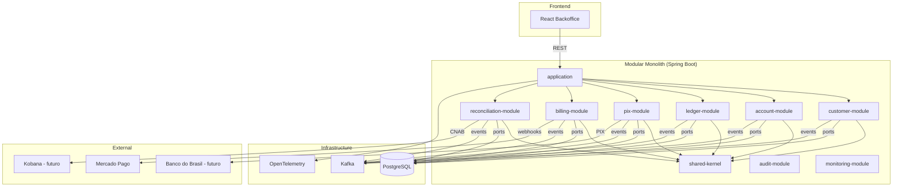
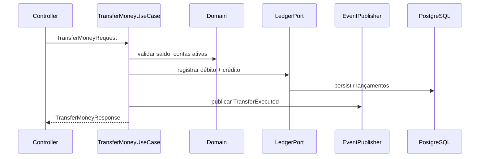
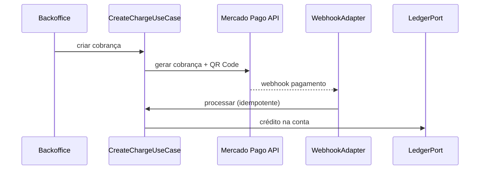

# Architecture

**Pattern:** Monorepo + Modular Monolith + Hexagonal Architecture + Vertical Slice Architecture + DDD Light
**Status:** Sprint 1 parcial — `shared-kernel`, `customer-module`, `account-module` e `application` (jwt-auth) com vertical slices implementadas (`create-customer`, `query-customers`, `create-account`, `jwt-auth`). Demais módulos conforme roadmap.

## High-Level Structure



## Identified Patterns

### Hexagonal Architecture (Ports & Adapters)

**Location:** Cada módulo de negócio (`customer-module`, `account-module`, etc.)
**Purpose:** Isolar domínio de frameworks (Spring, JPA, Kafka, HTTP)
**Implementation:**

```text
module/
├── domain/          # Entidades, VOs, regras — sem dependência de framework
├── application/     # Use cases, orquestração
├── ports/           # Interfaces (inbound/outbound)
├── adapters/        # Controllers, consumers, repositórios
└── infrastructure/  # Configuração Spring, beans
```

**Example:** `customer-module` e `account-module` — domain sem Spring; adapters em `adapters/persistence`, `adapters/messaging`. Consultas read-only via `CustomerQueryPort` em `query-customers`.

### Vertical Slice Architecture

**Location:** Dentro de cada módulo, pasta `features/`
**Purpose:** Isolar funcionalidades completas (controller → use case → test) por slice
**Implementation:** Cada feature contém Controller, UseCase, Request/Response DTOs e Test na mesma pasta
**Example:** `account-module/features/createaccount/CreateAccountUseCase.java`; `customer-module/features/querycustomers/QueryCustomersController.java` (GET list + by id); `application/features/auth/LoginController.java` (POST login)

### Stateless JWT Authentication (cross-cutting)

**Location:** `application/infrastructure/security/`, `application/features/auth/`
**Purpose:** Autenticação stateless para SPA React; proteção de `/api/v1/**` com rollout via `security.jwt.enabled`
**Implementation:** Spring Security 6 + `JwtAuthenticationFilter` + Problem Details 401/403; usuários v1 in-memory (`operator`, `admin`)
**ADR:** [ADR-0005](../../adr/0005-spring-security-authentication.md)

### Event-Driven Architecture

**Location:** Publicação via ports de saída; consumo em adapters Kafka
**Purpose:** Desacoplar módulos e garantir auditabilidade
**Implementation:** Domain events publicados após transação bem-sucedida; consumers idempotentes e retryable

**Domain Events planejados:**

| Evento | Módulo origem | Gatilho | Status |
|--------|---------------|---------|--------|
| AccountCreated | account | Conta criada | ✅ Implementado (topic `account-created`) |
| TransferExecuted | account | Transferência concluída | Planejado |
| LedgerEntryCreated | ledger | Lançamento registrado | Planejado |
| PixSent / PixReceived | pix | PIX enviado/recebido | Planejado |
| ChargeCreated / ChargePaid | billing | Cobrança criada/liquidada | Planejado |
| ReconciliationExecuted | reconciliation | Conciliação concluída | Planejado |

### Ledger-First (Double Entry)

**Location:** `ledger-module` — fonte oficial da verdade financeira
**Purpose:** Garantir auditabilidade e consistência financeira
**Implementation:** Toda operação financeira gera débito + crédito; saldo é projeção derivada de lançamentos
**Regra crítica:** Proibido `account.setBalance(...)` — ver `AGENTS.md` Rule 3

## Data Flow

### Transferência entre Contas



### Cobrança com Webhook Mercado Pago



## Code Organization

**Approach:** Domain-driven, feature-based dentro de módulos verticais

**Structure (planejada):**

```text
financial-platform-lab/
├── backend/
│   ├── shared-kernel/
│   ├── customer-module/
│   ├── account-module/
│   ├── ledger-module/
│   ├── pix-module/
│   ├── billing-module/
│   ├── reconciliation-module/
│   ├── audit-module/
│   ├── monitoring-module/
│   └── application/
├── frontend/
├── infra/
├── docs/
├── specs/          # specs legadas (se houver)
├── adr/
├── .specs/         # tlc-spec-driven
└── scripts/
```

**Module boundaries:**

| Módulo | Responsabilidade | Dependências permitidas |
|--------|------------------|-------------------------|
| shared-kernel | VOs compartilhados (Money, CPF, CNPJ) | Nenhuma de módulos de negócio |
| customer | Cadastro de clientes | shared-kernel |
| account | Contas, transferências | shared-kernel, ledger (via port) |
| ledger | Lançamentos financeiros | shared-kernel |
| pix | Operações PIX | shared-kernel, ledger, account |
| billing | Cobranças | shared-kernel, ledger, Mercado Pago |
| reconciliation | CNAB, conciliação | shared-kernel, ledger |
| audit | Rastreabilidade | Todos via eventos |
| monitoring | Métricas | Infra observability |

**Forbidden dependencies:**

```text
Domain → Controller | Repository Impl | Spring | Kafka | REST
Controller → Domain (direto, sem UseCase)
```
