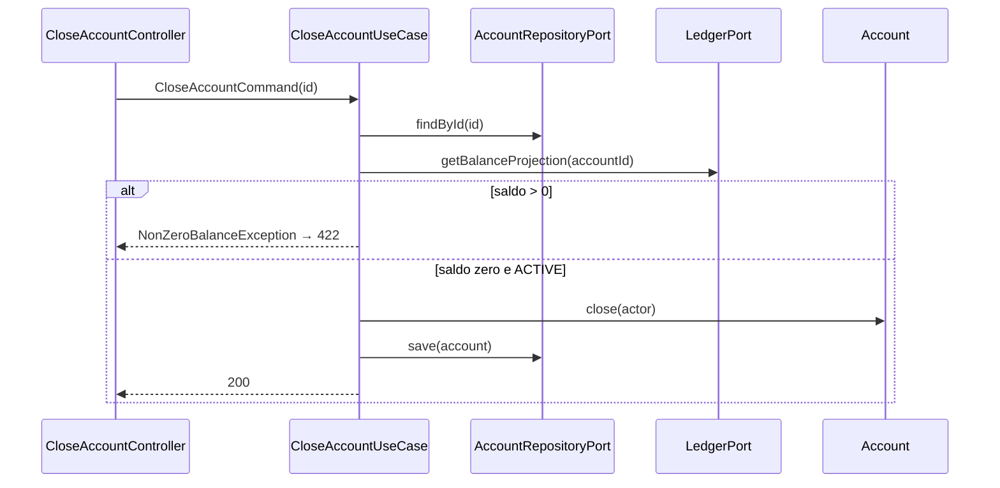

# Close Account — Design

**Spec:** `.specs/features/close-account/spec.md`
**Status:** Draft

---

## Architecture Overview



---

## Code Reuse Analysis

| Component | Location | How to Use |
| --------- | -------- | ---------- |
| `Account` | account-module/domain | Método `close(actor)` com guard ACTIVE |
| `LedgerPort.getBalanceProjection` | create-account design | Consulta saldo antes close |
| `Money.zero()` | shared-kernel | Comparação saldo |
| `AccountRepositoryPort` | create-account | findById, save |

---

## Components

### Account.close()

- **Rules:** Só ACTIVE; lança se já CLOSED
- **Side effect:** status CLOSED, touch auditoria, opcional AccountClosed event (P3)

### CloseAccountUseCase

- Load account → ledger balance → domain close → save

### CloseAccountController

- `POST /api/v1/accounts/{id}/close` — sem body ou body opcional `{ "reason": "..." }` (P3)

---

## Data Models

### Response 200

```json
{
  "data": {
    "id": "...",
    "status": "CLOSED",
    "closedAt": "2026-06-15T11:00:00Z"
  },
  "metadata": {}
}
```

---

## Ports

Reutiliza `AccountRepositoryPort`, `LedgerPort` — sem novos ports.

---

## Error Handling

| Exception | HTTP |
| --------- | ---- |
| AccountNotFoundException | 404 |
| AccountAlreadyClosedException | 409 |
| NonZeroBalanceException | 422 |
| InvalidAccountStateException | 409 |

---

## Tech Decisions

| Decision | Choice | Rationale |
| -------- | ------ | --------- |
| POST vs PATCH status | POST /close | Ação de negócio explícita |
| Saldo | LedgerPort only | Rule 3 AGENTS.md |
