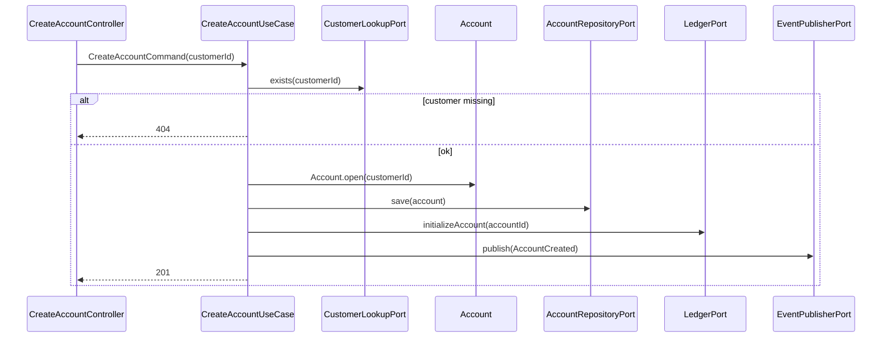
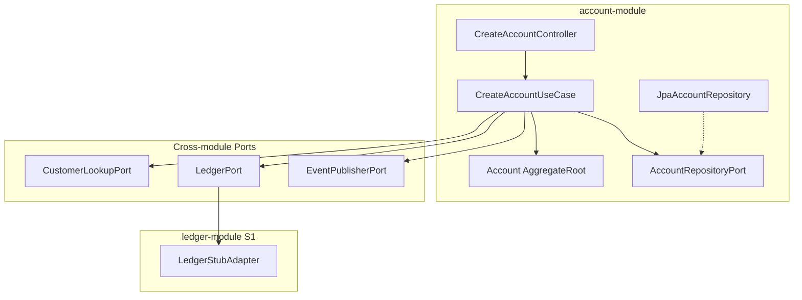

# Create Account — Design

**Spec:** `.specs/features/create-account/spec.md`
**Status:** Implemented

---

## Architecture Overview

Account-module orquestra validação de cliente (port cross-module), persistência de conta, registro ledger e publicação de evento — tudo transacional.





---

## Code Reuse Analysis

| Component | Location | How to Use |
| --------- | -------- | ---------- |
| `Identifier` | shared-kernel | IDs conta e customer |
| `AggregateRoot` | shared-kernel | Base `Account` |
| `DomainEvent` | shared-kernel | `AccountCreated` implements |
| `Money.zero()` | shared-kernel | Saldo inicial |
| Customer query | customer-module | `CustomerLookupPort` adapter HTTP ou bean in-process |

---

## Components

### Account (Aggregate)

- **Location:** `backend/account-module/domain/Account.java`
- **Factory:** `Account.open(Identifier customerId, String actor)` → status ACTIVE, register AccountCreated
- **Rules:** customerId obrigatório; status enum ACTIVE/CLOSED

### AccountCreated (Domain Event)

```java
public record AccountCreated(
    UUID eventId,
    Identifier aggregateId,
    Identifier customerId,
    Instant occurredAt
) implements DomainEvent {
    public String eventType() { return "AccountCreated"; }
}
```

### CreateAccountUseCase

- Valida customer via `CustomerLookupPort`
- Salva conta, chama `LedgerPort.initializeAccount`, publica eventos pendentes do agregado

### LedgerPort (outbound — definido em account ou ledger module)

```java
public interface LedgerPort {
    void initializeAccount(Identifier accountId);
    // Sprint 2+: recordTransferDebit/Credit
}
```

**S1 Stub:** `LedgerStubAdapter` persiste registro vazio ou no-op com projeção zero — implementação real no Sprint 2.

### CustomerLookupPort

```java
public interface CustomerLookupPort {
    boolean exists(Identifier customerId);
}
```

Adapter in-process chama `CustomerQueryPort` do customer-module (monólito modular).

---

## Data Models

### accounts table (Flyway V3)

```sql
CREATE TABLE accounts (
    id UUID PRIMARY KEY,
    customer_id UUID NOT NULL REFERENCES customers(id),
    status VARCHAR(20) NOT NULL,
    created_at TIMESTAMPTZ NOT NULL,
    created_by VARCHAR(100) NOT NULL,
    updated_at TIMESTAMPTZ NOT NULL,
    updated_by VARCHAR(100) NOT NULL
);
CREATE INDEX idx_accounts_customer_id ON accounts(customer_id);
```

**Nota:** Sem coluna `balance` — proibido por Rule 3.

### API Request/Response

**POST body:**
```json
{ "customerId": "550e8400-e29b-41d4-a716-446655440000" }
```

**201 data:**
```json
{
  "id": "...",
  "customerId": "...",
  "status": "ACTIVE",
  "createdAt": "2026-06-15T10:00:00Z"
}
```

---

## Ports

| Port | Module | Responsibility |
| ---- | ------ | -------------- |
| `AccountRepositoryPort` | account | Persistência conta |
| `CustomerLookupPort` | account | Verificar cliente |
| `LedgerPort` | account → ledger | Inicializar conta no ledger |
| `EventPublisherPort` | account | Kafka publish |

---

## Error Handling

| Scenario | HTTP |
| -------- | ---- |
| Customer not found | 404 |
| Ledger failure | 500 + rollback |
| Invalid customerId | 400 |

---

## Tech Decisions

| Decision | Choice | Rationale |
| -------- | ------ | --------- |
| Ledger S1 | Stub com projeção zero | Sprint 2 implementa partidas dobradas |
| initializeAccount | No-op ou metadata row | Prepara conta no ledger sem movimento |
| Event topic | `account-created` | ARCHITECTURE.md |
| Transação | @Transactional no use case adapter/infrastructure | Atomicidade DB + evento |
