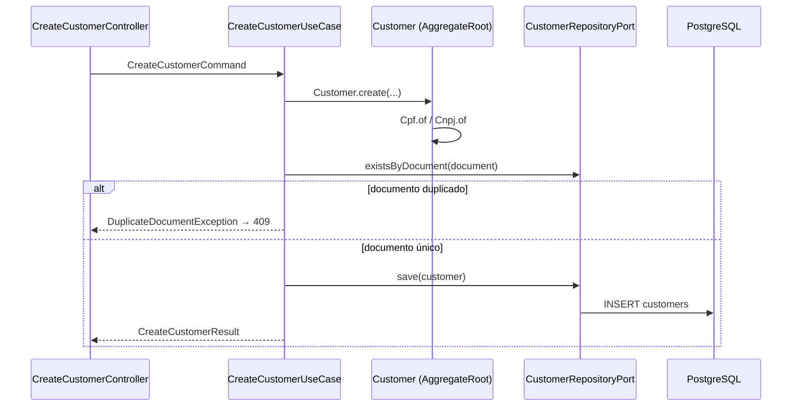
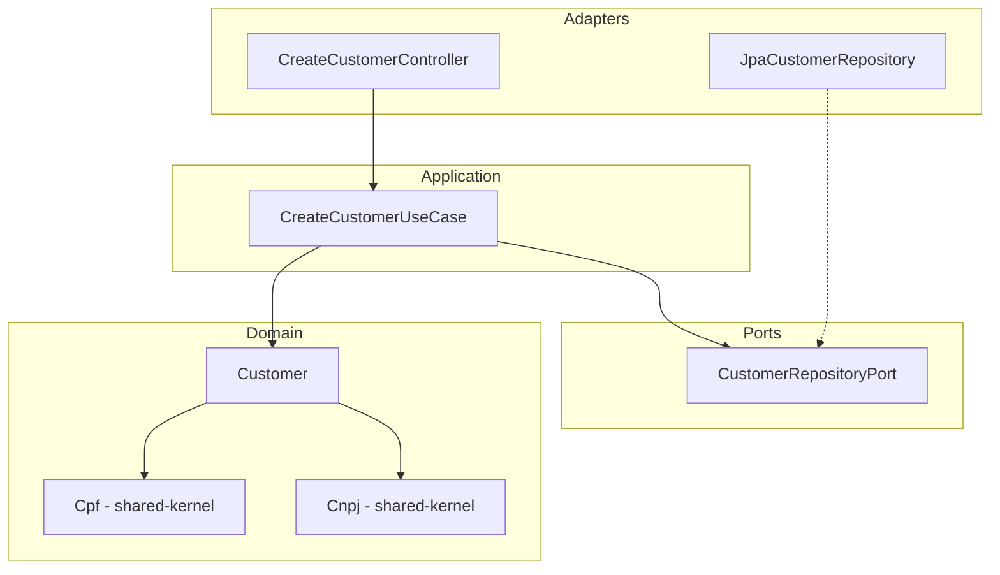

# Create Customer — Design

**Spec:** `.specs/features/create-customer/spec.md`
**Status:** Approved

---

## Architecture Overview

Vertical slice hexagonal dentro de `customer-module`. O controller adapta HTTP → DTO; o use case orquestra domínio e ports; regras de validação de documento e unicidade ficam no domínio/application.





---

## Code Reuse Analysis

### Existing Components to Leverage

| Component | Location | How to Use |
| --------- | -------- | ---------- |
| `Cpf` | `shared-kernel/domain/Cpf.java` | Factory `Cpf.of(raw)` na factory method do agregado |
| `Cnpj` | `shared-kernel/domain/Cnpj.java` | Factory `Cnpj.of(raw)` para PJ |
| `Identifier` | `shared-kernel/domain/Identifier.java` | ID do agregado `Customer` |
| `AggregateRoot` | `shared-kernel/domain/AggregateRoot.java` | Base de `Customer` (eventos futuros) |
| `AuditableEntity` | `shared-kernel/domain/AuditableEntity.java` | Metadados created/updated |
| Flyway placeholder | `application/.../V1__init.sql` | Nova migration `V2__customers.sql` |

### Integration Points

| System | Integration Method |
| ------ | ------------------ |
| PostgreSQL | JPA entity + Flyway migration com UNIQUE em `document` |
| Spring Boot | Bean wiring em `customer-module/infrastructure` |
| account-module | Consulta cliente por ID via port futuro (S1: validação inline no create-account) |

---

## Components

### Customer (Aggregate Root)

- **Purpose:** Representar cliente PF/PJ com documento validado
- **Location:** `backend/customer-module/domain/Customer.java`
- **Interfaces:**
  - `static Customer create(name, type, documentRaw, email, actor)` — factory com validações
  - `Document document()` — retorna CPF ou CNPJ encapsulado
- **Dependencies:** `Cpf`, `Cnpj`, `Identifier`, `AggregateRoot`
- **Reuses:** shared-kernel VOs

### CreateCustomerUseCase

- **Purpose:** Orquestrar cadastro com verificação de unicidade
- **Location:** `backend/customer-module/features/create-customer/CreateCustomerUseCase.java`
- **Interfaces:**
  - `CreateCustomerResult execute(CreateCustomerCommand command)`
- **Dependencies:** `CustomerRepositoryPort`, clock para auditoria
- **Reuses:** padrão vertical slice do projeto

### CustomerRepositoryPort

- **Purpose:** Persistência e consulta de unicidade
- **Location:** `backend/customer-module/ports/CustomerRepositoryPort.java`
- **Interfaces:**
  - `boolean existsByDocument(String documentDigits)`
  - `Customer save(Customer customer)`
  - `Optional<Customer> findById(Identifier id)`
- **Dependencies:** nenhum framework

### CreateCustomerController

- **Purpose:** Adaptador HTTP inbound
- **Location:** `backend/customer-module/features/create-customer/CreateCustomerController.java`
- **Interfaces:**
  - `POST /api/v1/customers` → delega ao use case
- **Dependencies:** `CreateCustomerUseCase`, validação Bean Validation no Request
- **Reuses:** envelope `{ data, metadata }`, Problem Details para erros

### JpaCustomerRepository

- **Purpose:** Adapter outbound de persistência
- **Location:** `backend/customer-module/adapters/persistence/JpaCustomerRepository.java`
- **Dependencies:** Spring Data JPA
- **Reuses:** implementa `CustomerRepositoryPort`

---

## Data Models

### Customer (Domain)

```java
public final class Customer extends AggregateRoot {
    private final Identifier id;
    private final String name;
    private final CustomerType type; // INDIVIDUAL | COMPANY
    private final Document document; // sealed: CpfDocument | CnpjDocument
    private final Email email;
    // audit fields via composition or AuditableEntity pattern
}
```

### CustomerEntity (JPA)

```java
@Entity
@Table(name = "customers", uniqueConstraints = @UniqueConstraint(columnNames = "document"))
class CustomerEntity {
    UUID id;
    String name;
    String type;
    String document;      // digits only, indexed UNIQUE
    String email;
    Instant createdAt;
    String createdBy;
    Instant updatedAt;
    String updatedBy;
}
```

**Relationships:** 1 Customer → N Accounts (account-module, FK futura em `accounts.customer_id`)

### API Contract — Request

```json
{
  "name": "Maria Silva",
  "type": "INDIVIDUAL",
  "document": "123.456.789-09",
  "email": "maria@example.com"
}
```

### API Contract — Response (201)

```json
{
  "data": {
    "id": "550e8400-e29b-41d4-a716-446655440000",
    "name": "Maria Silva",
    "type": "INDIVIDUAL",
    "document": "123.456.789-09",
    "email": "maria@example.com",
    "createdAt": "2026-06-15T10:00:00Z"
  },
  "metadata": {}
}
```

---

## Ports

| Port | Direction | Responsibility |
| ---- | --------- | -------------- |
| `CustomerRepositoryPort` | Outbound | Persistência e existsByDocument |
| (inbound implícito) | Inbound | `CreateCustomerController` |

---

## Error Handling Strategy

| Error Scenario | Handling | User Impact |
| -------------- | -------- | ----------- |
| Documento inválido | `IllegalArgumentException` → 400 Problem Details | Mensagem clara de validação |
| Tipo/documento inconsistente | Domain exception → 400 | Indica mismatch PF/CNPJ |
| Documento duplicado | `DuplicateDocumentException` → 409 | Conflict com documento |
| Erro de persistência | 500 genérico, log com correlationId | Sem vazamento de SQL |

---

## Tech Decisions

| Decision | Choice | Rationale |
| -------- | ------ | --------- |
| Unicidade | UNIQUE constraint + check exists | Defesa em profundidade |
| Documento armazenado | Apenas dígitos | Normalização e index eficiente |
| Evento CustomerCreated | Não no S1 | YAGNI; AccountCreated é suficiente para fluxo demo |
| Actor S1 | `"system"` hardcoded | Auth em sprint futura |
