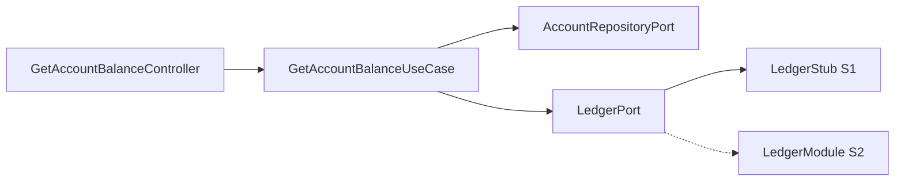
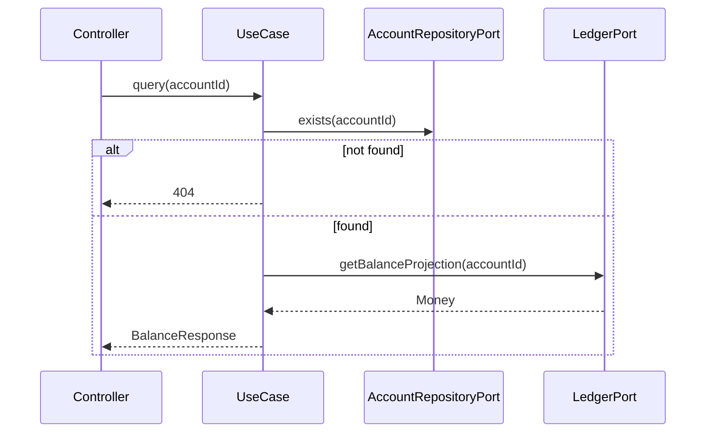

# Get Account Balance — Design

**Spec:** `.specs/features/get-account-balance/spec.md`
**Status:** Draft

---

## Architecture Overview

Query side fina: use case valida existência da conta e delega cálculo ao LedgerPort.





---

## Code Reuse Analysis

| Component | Location | How to Use |
| --------- | -------- | ---------- |
| `LedgerPort` | account/ledger ports | `getBalanceProjection(Identifier)` |
| `Money` | shared-kernel | Resposta tipada |
| `AccountRepositoryPort.findById` | create-account | Verificar existência |

---

## Components

### GetAccountBalanceUseCase

- **Location:** `backend/account-module/features/get-account-balance/GetAccountBalanceUseCase.java`
- **Logic:** exists → ledger projection → map to DTO

### GetAccountBalanceController

- **Location:** `backend/account-module/features/get-account-balance/GetAccountBalanceController.java`
- **Route:** `GET /api/v1/accounts/{id}/balance`

### LedgerPort (evolução)

```java
public interface LedgerPort {
    void initializeAccount(Identifier accountId);
    Money getBalanceProjection(Identifier accountId);
    // S2: recordEntries(TransferLedgerCommand cmd)
}
```

**S1 Stub:** Mantém saldo em memória/tabela `ledger_balance_projection` ou soma entries stub.
**S2:** Implementação real soma débitos/créditos.

---

## Data Models

### BalanceResponse (API)

```json
{
  "data": {
    "accountId": "550e8400-e29b-41d4-a716-446655440000",
    "amount": "1500.00",
    "currency": "BRL",
    "asOf": "2026-06-15T12:00:00Z"
  },
  "metadata": {}
}
```

### ledger_balance_projection (opcional S1 stub table)

```sql
-- V4 opcional para stub; Sprint 2 substituído por ledger_entries
CREATE TABLE ledger_balance_projection (
    account_id UUID PRIMARY KEY,
    amount NUMERIC(19,2) NOT NULL DEFAULT 0,
    currency CHAR(3) NOT NULL DEFAULT 'BRL',
    updated_at TIMESTAMPTZ NOT NULL
);
```

**Nota:** Valores atualizados apenas via LedgerPort após transferências — nunca via Account entity.

---

## Ports

| Port | Usage |
| ---- | ----- |
| `AccountRepositoryPort` | exists/findById |
| `LedgerPort` | getBalanceProjection |

---

## Error Handling

| Scenario | HTTP |
| -------- | ---- |
| Account not found | 404 |
| Ledger failure | 503 |
| Invalid UUID | 400 |

---

## Tech Decisions

| Decision | Choice | Rationale |
| -------- | ------ | --------- |
| Stub persistence | Tabela projection S1 | Permite demo transfer+balance antes Sprint 2 |
| asOf | Instant.now() na consulta | Transparência da projeção |
| Read-only | Sem transação de escrita | Performance |
