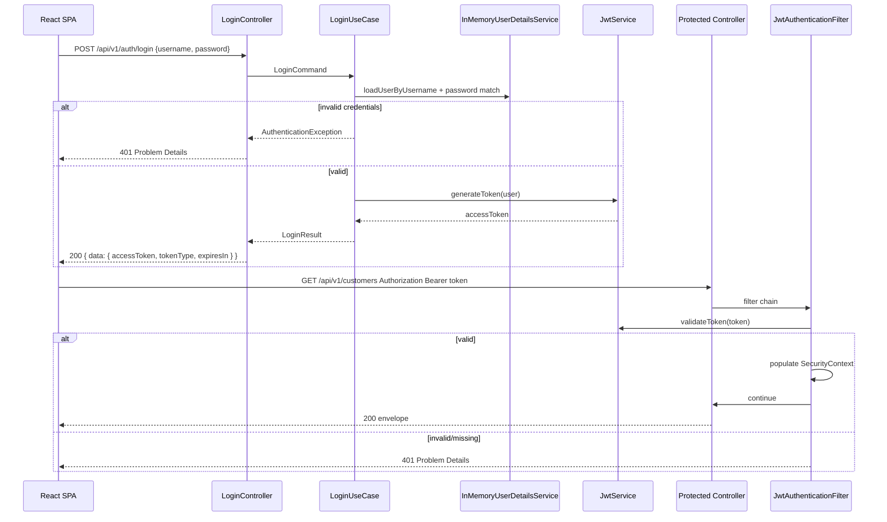
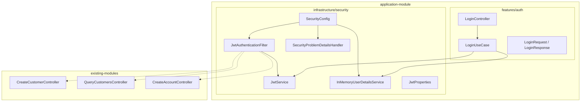

# JWT Auth — Design

**Spec:** `.specs/features/jwt-auth/spec.md`
**ADR:** [ADR-0005](../../../adr/0005-spring-security-authentication.md)
**Status:** Implemented

---

## Architecture Overview

Autenticação cross-cutting no módulo `application`: Spring Security com filtro JWT stateless, login como vertical slice em `features/auth/`, e handlers de erro alinhados ao padrão Problem Details do projeto.





---

## Code Reuse Analysis

| Component | Location | How to Use |
| --------- | -------- | ---------- |
| Problem Details pattern | `CustomerExceptionHandler`, `AGENTS.md` | Mesmo `Content-Type: application/problem+json` e URI base |
| Controller slice pattern | `customer-module/features/createcustomer/` | LoginController delega ao use case; sem lógica de negócio |
| Integration test base | `AbstractCustomerIntegrationTest`, `AbstractAccountWebIntegrationTest` | Estender com `JwtTestSupport` para Bearer token |
| Application wiring | `ApplicationWiringIntegrationTest` | Smoke com auth habilitada |
| Envelope success | Convenção REST | Login 200 usa `{ data, metadata }`; erros 401/403 não |

---

## Components

### SecurityConfig

- **Location:** `backend/application/src/main/java/com/financialplatform/infrastructure/security/SecurityConfig.java`
- **Responsibility:** `SecurityFilterChain` bean, regras de autorização, registro do `JwtAuthenticationFilter`
- **Rules (ADR-0005):**
  - `csrf.disable()` — API stateless
  - `sessionManagement.sessionCreationPolicy(STATELESS)`
  - Quando `security.jwt.enabled=true`:
    - `requestMatchers(POST, "/api/v1/auth/login").permitAll()`
    - `requestMatchers(POST, "/api/v1/webhooks/mercadopago").permitAll()`
    - `requestMatchers(GET, "/actuator/health").permitAll()`
    - `requestMatchers("/api/v1/**").authenticated()`
  - Quando `security.jwt.enabled=false`: `anyRequest().permitAll()` (rollout)

### JwtAuthenticationFilter

- **Location:** `backend/application/src/main/java/com/financialplatform/infrastructure/security/JwtAuthenticationFilter.java`
- **Responsibility:** Extrair Bearer token, validar via `JwtService`, popular `SecurityContextHolder`
- **Placement:** Antes de `UsernamePasswordAuthenticationFilter`

### JwtService

- **Location:** `backend/application/src/main/java/com/financialplatform/infrastructure/security/JwtService.java`
- **Methods:**
  - `String generateToken(AuthenticatedUser user)` — claims `sub`, `roles`, `iat`, `exp`
  - `Optional<Claims> parseAndValidate(String token)` — lança/retorna vazio em inválido
- **Signing:** HMAC-SHA256 com secret em `security.jwt.secret` (env `JWT_SECRET`)
- **TTL:** `security.jwt.expiration-seconds` (default 3600)

### InMemoryUserDetailsService (v1)

- **Location:** `backend/application/src/main/java/com/financialplatform/infrastructure/security/InMemoryUserDetailsService.java`
- **Users (configuráveis via `application.yml`):**

| Username | Password (env) | Roles |
| -------- | -------------- | ----- |
| `operator` | `JWT_OPERATOR_PASSWORD` | `OPERATOR` |
| `admin` | `JWT_ADMIN_PASSWORD` | `ADMIN`, `OPERATOR` |

- **Nota:** Senhas com `{noop}` ou `PasswordEncoder` BCrypt — preferir BCrypt em produção; v1 aceita noop para dev/test.

### SecurityProblemDetailsHandler

- **Location:** `backend/application/src/main/java/com/financialplatform/infrastructure/security/SecurityProblemDetailsHandler.java`
- **Responsibility:** `AuthenticationEntryPoint` (401) e `AccessDeniedHandler` (403) retornando Problem Details
- **Types:**
  - `https://api.financial-platform.lab/problems/invalid-credentials`
  - `https://api.financial-platform.lab/problems/token-expired`
  - `https://api.financial-platform.lab/problems/invalid-token`
  - `https://api.financial-platform.lab/problems/access-denied`

### LoginUseCase

- **Location:** `backend/application/src/main/java/com/financialplatform/features/auth/LoginUseCase.java`
- **Flow:** Autenticar via `AuthenticationManager` + `InMemoryUserDetailsService`; emitir token via `JwtService`
- **Exceptions:** Credenciais inválidas → exceção mapeada a 401 (não vazar se user existe)

### LoginController

- **Location:** `backend/application/src/main/java/com/financialplatform/features/auth/LoginController.java`
- **Endpoint:** `POST /api/v1/auth/login`
- **DTOs:** `LoginRequest` (`username`, `password`), `LoginResponse` (`accessToken`, `tokenType`, `expiresIn`)

---

## Configuration

### application.yml (novas propriedades)

```yaml
security:
  jwt:
    enabled: ${SECURITY_JWT_ENABLED:false}
    secret: ${JWT_SECRET:change-me-in-production-min-256-bits}
    expiration-seconds: ${JWT_EXPIRATION_SECONDS:3600}
    users:
      operator:
        password: ${JWT_OPERATOR_PASSWORD:operator}
        roles: OPERATOR
      admin:
        password: ${JWT_ADMIN_PASSWORD:admin}
        roles: ADMIN,OPERATOR
```

### Maven dependencies (application/pom.xml)

- `spring-boot-starter-security`
- `jjwt-api`, `jjwt-impl`, `jjwt-jackson` (ou `nimbus-jose-jwt` — escolher uma lib; jjwt é padrão Spring Security JWT tutorials)

---

## SecurityFilterChain Rules (ADR-0005)

| Pattern | Method | Auth |
| ------- | ------ | ---- |
| `/api/v1/auth/login` | POST | permitAll |
| `/api/v1/webhooks/mercadopago` | POST | permitAll |
| `/actuator/health` | GET | permitAll |
| `/api/v1/**` | * | authenticated (JWT) |
| Demais (actuator metrics, etc.) | * | authenticated ou deny conforme política — v1: `authenticated` exceto health |

---

## API Contract

### POST /api/v1/auth/login

**Request:**
```json
{
  "username": "operator",
  "password": "operator"
}
```

**200 Response:**
```json
{
  "data": {
    "accessToken": "eyJhbGciOiJIUzI1NiIs...",
    "tokenType": "Bearer",
    "expiresIn": 3600
  },
  "metadata": {}
}
```

**401 Problem Details:**
```json
{
  "type": "https://api.financial-platform.lab/problems/invalid-credentials",
  "title": "Credenciais inválidas",
  "status": 401,
  "detail": "Usuário ou senha incorretos.",
  "instance": "/api/v1/auth/login"
}
```

---

## Test Strategy

### JwtTestSupport

- **Location:** `backend/application/src/test/java/com/financialplatform/support/JwtTestSupport.java` (ou módulo compartilhado de teste)
- **API:**
  - `String obtainOperatorToken(MockMvc mvc)` — login e retorna accessToken
  - `RequestPostProcessor bearerToken(String token)` — header `Authorization`
- **Uso:** ITs de customer-module e account-module importam helper para requests autenticados

### IT suites a atualizar (4)

| Suite | Path | Change |
| ----- | ---- | ------ |
| Query customers | `QueryCustomersControllerIntegrationTest` | `@DynamicPropertySource` → `security.jwt.enabled=true`; requests com Bearer |
| Create customer | `CreateCustomerControllerIntegrationTest` | Idem |
| Create account | `CreateAccountControllerIntegrationTest` | Idem (`AbstractAccountWebIntegrationTest`) |
| Application wiring | `ApplicationWiringIntegrationTest` | Smoke login + chamada autenticada |

### Test properties (IT)

```properties
security.jwt.enabled=true
security.jwt.secret=test-secret-key-at-least-256-bits-long-for-hs256
JWT_OPERATOR_PASSWORD=operator
JWT_ADMIN_PASSWORD=admin
```

### Unit tests

| Component | Focus |
| --------- | ----- |
| `JwtServiceTest` | generate + validate + expired |
| `LoginUseCaseTest` | happy path + bad credentials |
| `SecurityProblemDetailsHandlerTest` | JSON shape 401/403 |

---

## Phased Rollout

```text
Phase A (T1–T6): security.jwt.enabled=false (default)
  → SecurityConfig carregado; login endpoint funcional; APIs ainda permitAll

Phase B (T7–T8): security.jwt.enabled=true em ITs via JwtTestSupport
  → Proteção ativa nos testes; suites migradas

Phase C (T13 docs): default production recommendation security.jwt.enabled=true
  → Documentar em README / .env.example
```

**Rationale:** Evita quebrar ITs existentes enquanto login e filtro são implementados incrementalmente.

---

## Tech Decisions

| Decision | Choice | Rationale |
| -------- | ------ | --------- |
| Módulo | `application` | Cross-cutting; não pertence a customer/account |
| User store v1 | InMemoryUserDetailsService | YAGNI; ADR-0005 não exige DB de usuários |
| Token type | Access token only | Refresh fora do escopo v1 |
| Session | STATELESS | ADR-0005; escala horizontal |
| Error format | Problem Details via handlers dedicados | Consistência com domain handlers |
| Rollout flag | `security.jwt.enabled` | Migração segura de ITs S1 |
| Webhook MP | permitAll na v1 | HMAC em `process-payment-webhook` |

---

## Error Handling

| Scenario | HTTP | Problem type |
| -------- | ---- | -------------- |
| Credenciais inválidas | 401 | `invalid-credentials` |
| Token ausente | 401 | `invalid-token` |
| Token expirado | 401 | `token-expired` |
| Token malformado/assinatura inválida | 401 | `invalid-token` |
| Role insuficiente | 403 | `access-denied` |
| Body login inválido | 400 | validação padrão Spring |
