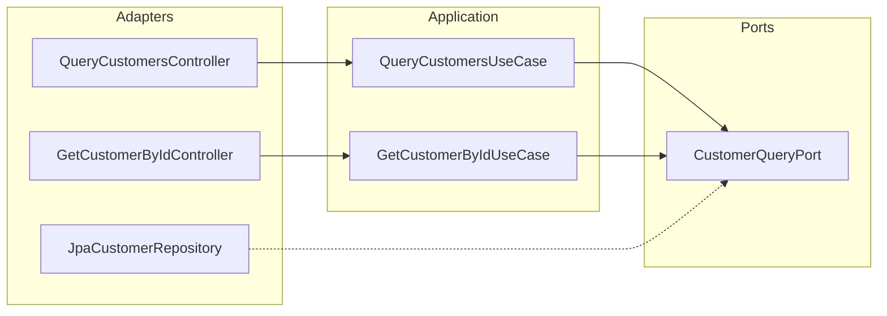
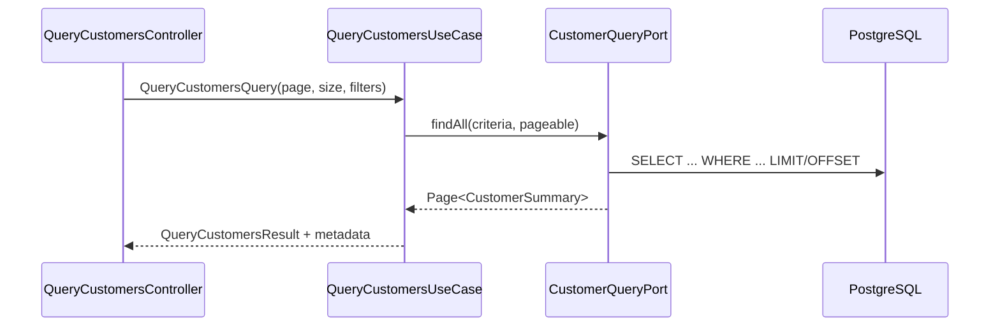

# Query Customers — Design

**Spec:** `.specs/features/query-customers/spec.md`
**Status:** Implemented

**Implementation note:** Single `QueryCustomersController` exposes both GET list and GET by id (two methods, one class). The diagram below shows two controller nodes for clarity; there is no separate `GetCustomerByIdController`.

---

## Architecture Overview

Consultas read-only via use cases dedicados (CQRS light). Repositório expõe métodos de query; domínio não muda estado.





---

## Code Reuse Analysis

### Existing Components to Leverage

| Component | Location | How to Use |
| --------- | -------- | ---------- |
| `CustomerRepositoryPort` | create-customer | Estender ou separar `CustomerQueryPort` |
| `Customer` aggregate | customer-module/domain | Mapper para DTO de leitura |
| `Identifier` | shared-kernel | Parse de path `{id}` |
| Paginação Spring | Spring Data | `Pageable` no adapter apenas |

### Integration Points

| System | Integration Method |
| ------ | ------------------ |
| PostgreSQL | JPA Specification ou query methods |
| create-account | Valida customerId via `GetCustomerByIdUseCase` ou port compartilhado |

---

## Components

### CustomerQueryPort

- **Purpose:** Operações read-only de clientes
- **Location:** `backend/customer-module/ports/CustomerQueryPort.java`
- **Interfaces:**
  - `Optional<Customer> findById(Identifier id)`
  - `PageResult<CustomerSummary> findAll(CustomerFilter filter, PageRequest page)`
- **Dependencies:** nenhum framework no port

### QueryCustomersUseCase

- **Purpose:** Listar com filtros e paginação
- **Location:** `backend/customer-module/features/query-customers/QueryCustomersUseCase.java`
- **Interfaces:** `QueryCustomersResult execute(QueryCustomersQuery query)`

### GetCustomerByIdUseCase

- **Purpose:** Busca unitária
- **Location:** `backend/customer-module/features/query-customers/GetCustomerByIdUseCase.java`
- **Interfaces:** `CustomerDetailResult execute(GetCustomerByIdQuery query)`
- **Errors:** `CustomerNotFoundException` → 404

### QueryCustomersController

- **Purpose:** Adaptador HTTP único com dois endpoints GET (list + by id)
- **Location:** `backend/customer-module/features/query-customers/QueryCustomersController.java`

---

## Data Models

### CustomerSummary (read model)

```java
public record CustomerSummary(
    UUID id,
    String name,
    CustomerType type,
    String documentFormatted,
    String email,
    Instant createdAt
) {}
```

### CustomerFilter

```java
public record CustomerFilter(
    Optional<String> name,
    Optional<CustomerType> type,
    Optional<String> documentDigits
) {}
```

### API — GET /api/v1/customers

**Query params:** `page`, `size`, `name`, `type`, `document`

**Response 200:**

```json
{
  "data": [
    {
      "id": "550e8400-e29b-41d4-a716-446655440000",
      "name": "Maria Silva",
      "type": "INDIVIDUAL",
      "document": "529.982.247-25",
      "email": "maria@example.com",
      "createdAt": "2026-06-15T10:00:00Z"
    }
  ],
  "metadata": {
    "page": 0,
    "size": 20,
    "totalElements": 1,
    "totalPages": 1
  }
}
```

### API — GET /api/v1/customers/{id}

**Response 200:** objeto único em `data` (mesmos campos + `updatedAt`).

---

## Ports

| Port | Direction | Responsibility |
| ---- | --------- | -------------- |
| `CustomerQueryPort` | Outbound | Queries paginadas e by id |

---

## Error Handling Strategy

| Error Scenario | Handling | User Impact |
| -------------- | -------- | ----------- |
| Cliente não encontrado | 404 Problem Details | Mensagem clara |
| UUID inválido | 400 | Validation error |
| Parâmetros paginação inválidos | 400 | Limites documentados |

---

## Tech Decisions

| Decision | Choice | Rationale |
| -------- | ------ | --------- |
| Port separado vs estender save port | `CustomerQueryPort` separado | ISP — queries não misturam com commands |
| Filtro nome | ILIKE `%name%` | Suficiente S1; índice trigram futuro |
| DTO vs expor domain | DTO read model | Evita leak de agregado |
