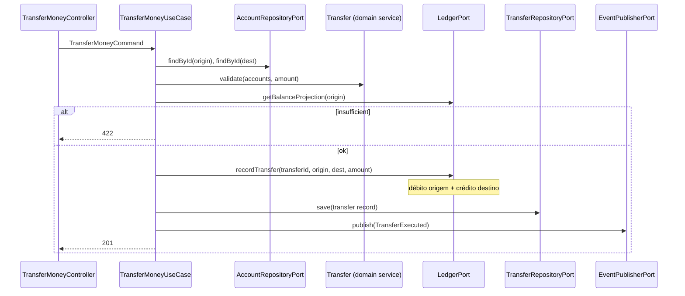
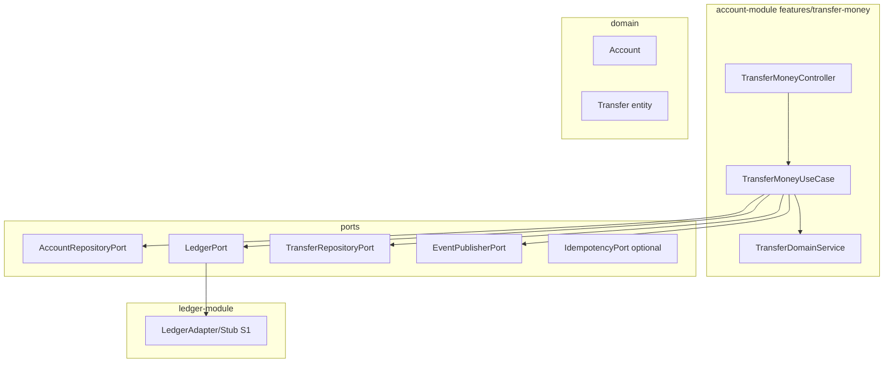

# Transfer Money — Design

**Spec:** `.specs/features/transfer-money/spec.md`
**Status:** Draft

---

## Architecture Overview

Orquestração transacional no use case: carrega contas, valida no domínio, invoca ledger para partidas dobradas, persiste metadados da transferência, publica evento.





---

## Code Reuse Analysis

| Component | Location | How to Use |
| --------- | -------- | ---------- |
| `Money` | shared-kernel | amount, validações, comparação saldo |
| `Identifier` | shared-kernel | account IDs, transferId |
| `AggregateRoot` / events | shared-kernel | TransferExecuted implements DomainEvent |
| `Account` | account-module | isActive(), guards |
| `LedgerPort` | get-account-balance design | Estender recordTransfer |
| `EventPublisherPort` | create-account | Publicar transfer-executed |

---

## Components

### Transfer (Entity / Aggregate)

- **Location:** `backend/account-module/domain/Transfer.java`
- **Fields:** id, originAccountId, destinationAccountId, amount (Money), status COMPLETED, correlationId, createdAt
- **Factory:** `Transfer.execute(...)` valida amount > 0

### TransferDomainService

- **Purpose:** Regras que envolvem duas contas (não pertence a um agregado único)
- **Location:** `backend/account-module/domain/TransferDomainService.java`
- **Methods:** `validateAccountsActiveAndDistinct(origin, dest, amount)`

### TransferMoneyUseCase

- **Location:** `backend/account-module/features/transfer-money/TransferMoneyUseCase.java`
- **Flow:**
  1. Idempotency check (P2)
  2. Load accounts
  3. Domain validation
  4. Balance check via LedgerPort
  5. LedgerPort.recordTransfer (atomic)
  6. Save transfer metadata
  7. Publish TransferExecuted

### TransferExecuted (Domain Event)

```java
public record TransferExecuted(
    UUID eventId,
    Identifier aggregateId,      // transferId
    Identifier originAccountId,
    Identifier destinationAccountId,
    BigDecimal amount,
    String currency,
    String correlationId,
    Instant occurredAt
) implements DomainEvent
```

### LedgerPort (extended)

```java
public interface LedgerPort {
    void initializeAccount(Identifier accountId);
    Money getBalanceProjection(Identifier accountId);

    /**
     * Registra partidas dobradas: débito origem, crédito destino.
     * Deve ser atômico. Sprint 2: ledger_entries reais.
     */
    void recordTransfer(
        Identifier transferId,
        Identifier originAccountId,
        Identifier destinationAccountId,
        Money amount,
        String correlationId
    );
}
```

**S1 Stub behavior:**
- Valida saldo origem internamente (defense in depth)
- Atualiza `ledger_balance_projection` ou entries stub em transação
- Sprint 2: substituir por débito/crédito em `ledger_entries`

### TransferRepositoryPort

```java
public interface TransferRepositoryPort {
    Transfer save(Transfer transfer);
    Optional<Transfer> findByIdempotencyKey(String key);
}
```

---

## Data Models

### transfers table (V5)

```sql
CREATE TABLE transfers (
    id UUID PRIMARY KEY,
    origin_account_id UUID NOT NULL REFERENCES accounts(id),
    destination_account_id UUID NOT NULL REFERENCES accounts(id),
    amount NUMERIC(19,2) NOT NULL,
    currency CHAR(3) NOT NULL DEFAULT 'BRL',
    status VARCHAR(20) NOT NULL,
    correlation_id UUID NOT NULL,
    idempotency_key VARCHAR(100) UNIQUE,
    created_at TIMESTAMPTZ NOT NULL,
    created_by VARCHAR(100) NOT NULL
);
CREATE INDEX idx_transfers_origin ON transfers(origin_account_id);
CREATE INDEX idx_transfers_correlation ON transfers(correlation_id);
```

### ledger_entries stub (S1 — optional V4)

```sql
CREATE TABLE ledger_entries_stub (
    id UUID PRIMARY KEY,
    transfer_id UUID,
    account_id UUID NOT NULL,
    entry_type VARCHAR(10) NOT NULL, -- DEBIT | CREDIT
    amount NUMERIC(19,2) NOT NULL,
    currency CHAR(3) NOT NULL,
    correlation_id UUID NOT NULL,
    created_at TIMESTAMPTZ NOT NULL
);
```

### API Contract

**Request:**
```json
{
  "originAccountId": "550e8400-e29b-41d4-a716-446655440000",
  "destinationAccountId": "660e8400-e29b-41d4-a716-446655440001",
  "amount": "250.50",
  "correlationId": "770e8400-e29b-41d4-a716-446655440002",
  "idempotencyKey": "client-req-001"
}
```

**Response 201:**
```json
{
  "data": {
    "transferId": "...",
    "originAccountId": "...",
    "destinationAccountId": "...",
    "amount": "250.50",
    "currency": "BRL",
    "status": "COMPLETED",
    "correlationId": "...",
    "createdAt": "2026-06-15T14:00:00Z"
  },
  "metadata": {}
}
```

---

## Ports Summary

| Port | Direction | Responsibility |
| ---- | --------- | -------------- |
| `AccountRepositoryPort` | Outbound | Load accounts |
| `LedgerPort` | Outbound | Balance + recordTransfer |
| `TransferRepositoryPort` | Outbound | Persist transfer audit trail |
| `EventPublisherPort` | Outbound | Kafka transfer-executed |
| `IdempotencyPort` | Outbound (P2) | Optional dedup store |

---

## Error Handling Strategy

| Scenario | HTTP | Exception |
| -------- | ---- | --------- |
| Insufficient balance | 422 | InsufficientBalanceException |
| Same origin/dest | 400 | SameAccountTransferException |
| Account closed | 409 | InactiveAccountException |
| Account not found | 404 | AccountNotFoundException |
| Invalid amount | 400 | InvalidAmountException |
| Duplicate idempotency | 201 (cached) | Return existing |

---

## Transaction Boundaries

`@Transactional` no use case (infrastructure) ou adapter:
1. recordTransfer (ledger)
2. save transfer
3. publish event (after commit — TransactionalEventListener ou outbox S1 simplificado: publish in same TX with Kafka retry)

---

## Tech Decisions

| Decision | Choice | Rationale |
| -------- | ------ | --------- |
| Ledger S1 | Stub com entries DEBIT/CREDIT | Antecipa Sprint 2 sem violar Rule 3 |
| Transfer entity | account-module | Transferência é capability de account no bounded context |
| Domain service | TransferDomainService | Regra cross-aggregate |
| Idempotency | UNIQUE idempotency_key | AGENTS.md idempotency external ops |
| Topic | `transfer-executed` | ARCHITECTURE.md |

---

## Anticipação Sprint 2 (Ledger)

Quando ledger-module real existir:
- `LedgerStubAdapter` → `LedgerAdapter` com partidas dobradas imutáveis
- `getBalanceProjection` = SUM(credits) - SUM(debits)
- `recordTransfer` insere 2+ entries ligadas por transferId
- Account-module mantém mesma interface `LedgerPort` — zero change no use case
