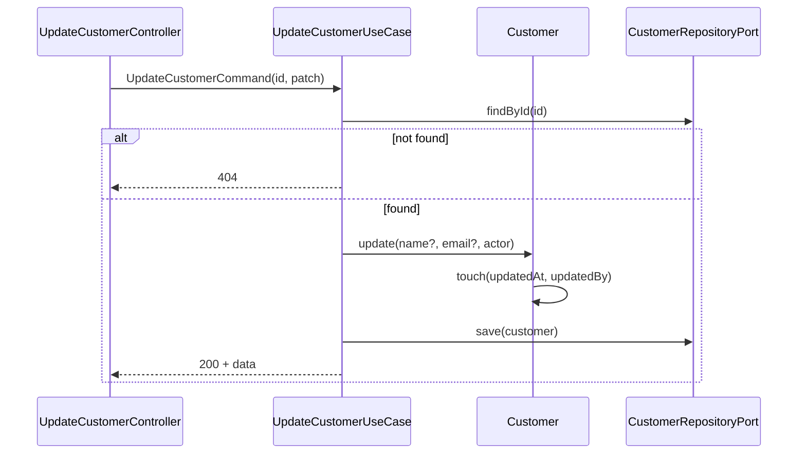

# Update Customer — Design

**Spec:** `.specs/features/update-customer/spec.md`
**Status:** Draft

---

## Architecture Overview

Command side: use case carrega agregado, delega mutação ao domínio, persiste via repository port existente.



---

## Code Reuse Analysis

| Component | Location | How to Use |
| --------- | -------- | ---------- |
| `Customer` | customer-module/domain | Adicionar método `update(...)` |
| `CustomerRepositoryPort` | create-customer | `findById`, `save` |
| `AuditableEntity.touch` | shared-kernel | Auditoria de modificação |
| `GetCustomerByIdUseCase` | query-customers | Reutilizar exception 404 pattern |

---

## Components

### Customer.update (domain method)

- **Purpose:** Aplicar regras de campos mutáveis
- **Location:** `backend/customer-module/domain/Customer.java`
- **Rules:** Rejeita alteração document/type; valida email; chama touch

### UpdateCustomerUseCase

- **Purpose:** Orquestrar load → update → save
- **Location:** `backend/customer-module/features/update-customer/UpdateCustomerUseCase.java`

### UpdateCustomerController

- **Purpose:** `PATCH /api/v1/customers/{id}`
- **Location:** `backend/customer-module/features/update-customer/UpdateCustomerController.java`
- **Validation:** Rejeita campos proibidos no adapter (mapeamento) + domínio

---

## Data Models

### UpdateCustomerRequest

```json
{
  "name": "Maria Santos",
  "email": "maria.santos@example.com",
  "phone": "+5511999999999"
}
```

Campos proibidos se presentes: `document`, `type`, `id`

### Response 200

Mesmo shape de GET by id em `data`.

---

## Ports

Reutiliza `CustomerRepositoryPort` (command) — sem novo port.

---

## Error Handling

| Scenario | HTTP | Exception |
| -------- | ---- | --------- |
| Not found | 404 | CustomerNotFoundException |
| document/type no body | 400 | ImmutableFieldException |
| Email inválido | 400 | Domain validation |
| Body vazio | 400 | NoFieldsToUpdateException |

---

## Tech Decisions

| Decision | Choice | Rationale |
| -------- | ------ | --------- |
| PATCH vs PUT | PATCH parcial | Alinhado REST CONVENTIONS |
| Validação campos proibidos | Controller + Domain | Defesa em profundidade |
