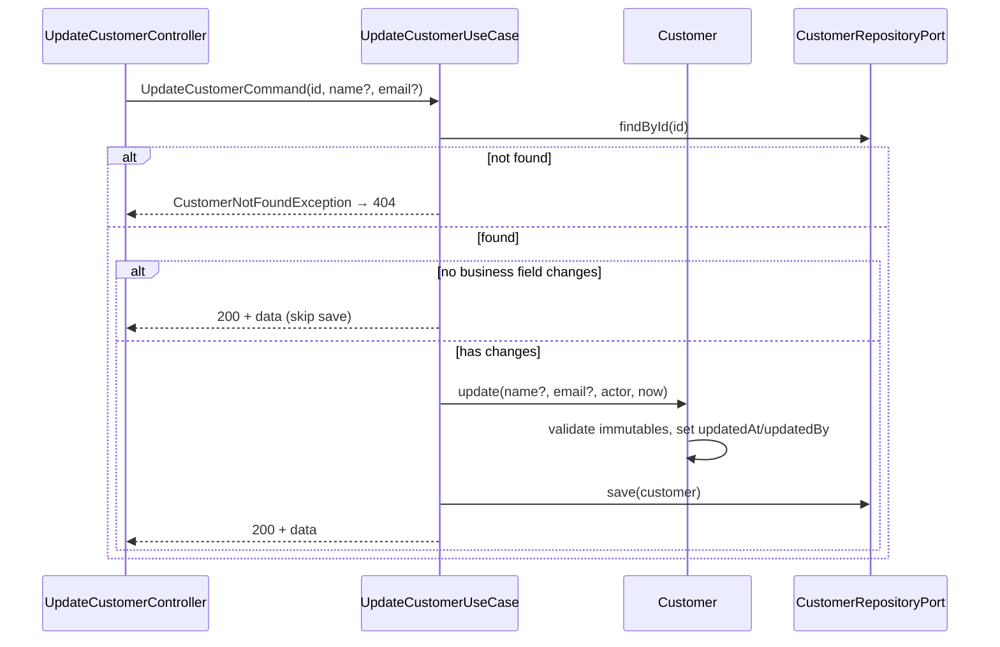
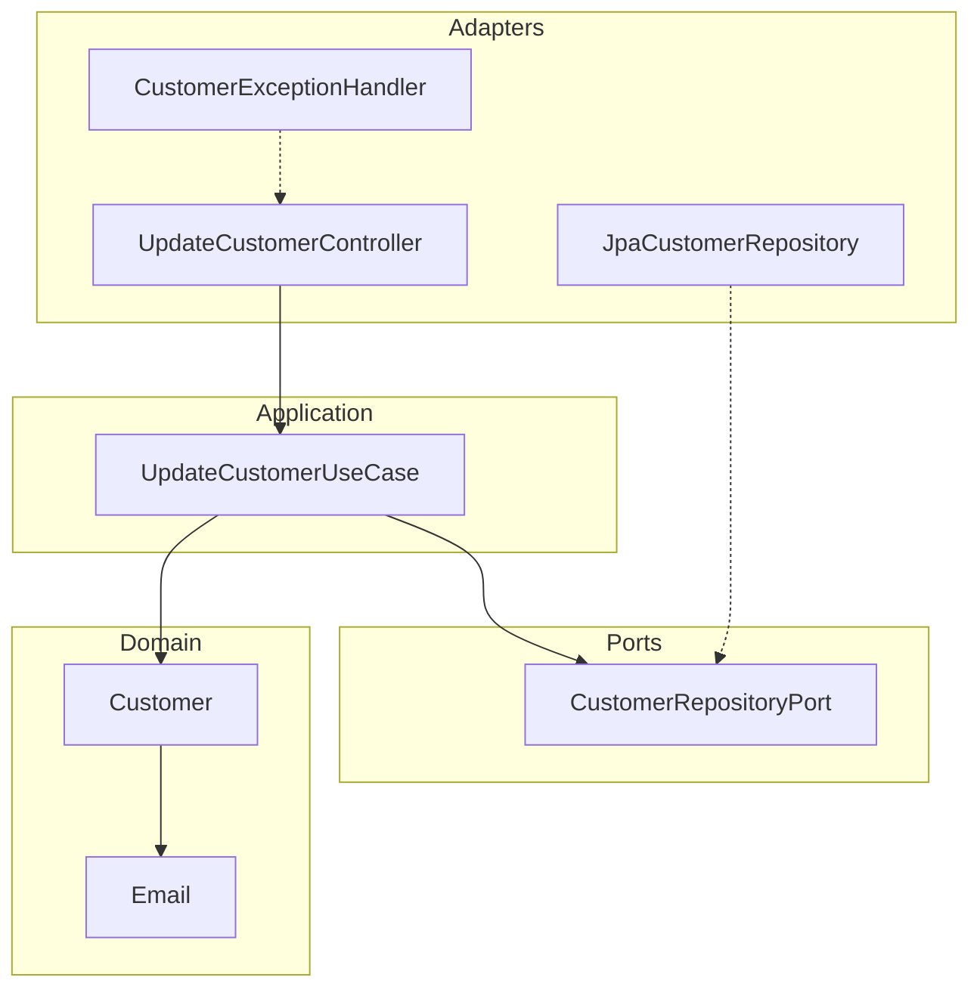

# Update Customer — Design

**Spec:** `.specs/features/update-customer/spec.md`
**Status:** Implemented

---

## Architecture Overview

Vertical slice hexagonal dentro de `customer-module`. O controller adapta HTTP → DTO; o use case carrega o agregado, delega mutação ao domínio e persiste via `CustomerRepositoryPort`. Regras de mutabilidade e auditoria ficam em `Customer.update(...)`.





---

## Code Reuse Analysis

### Existing Components to Leverage

| Component | Location | How to Use |
| --------- | -------- | ---------- |
| `Customer` | `backend/customer-module/domain/Customer.java` | Método `update(...)` com regras de mutabilidade |
| `CustomerRepositoryPort` | `backend/customer-module/ports/CustomerRepositoryPort.java` | `findById`, `save` |
| `Email` | `backend/customer-module/domain/Email.java` | Validação de e-mail no domínio |
| `CustomerNotFoundException` | `backend/customer-module/domain/` | Padrão 404 reutilizado de query-customers |
| `CustomerExceptionHandler` | `backend/customer-module/infrastructure/CustomerExceptionHandler.java` | Problem Details para erros de update |

### Integration Points

| System | Integration Method |
| ------ | ------------------ |
| PostgreSQL | JPA entity existente — sem migration adicional |
| Spring Boot | Bean wiring em `customer-module/infrastructure/CustomerModuleConfig` |
| create-customer | Mesmo agregado, tabela e repository port |

---

## Components

### Customer (Aggregate Root)

- **Purpose:** Aplicar regras de campos mutáveis e registrar auditoria inline
- **Location:** `backend/customer-module/domain/Customer.java`
- **Interfaces:**
  - `Customer update(name, email, type, documentRaw, actor, now)` — retorna nova instância imutável
- **Rules:**
  - Rejeita `type` ou `document` não-nulos via `ImmutableFieldException`
  - Valida nome não-vazio e e-mail via `Email.of(...)`
  - Define `updatedAt` e `updatedBy` diretamente no construtor da nova instância (sem `AuditableEntity.touch`)

### UpdateCustomerUseCase

- **Purpose:** Orquestrar load → update → save
- **Location:** `backend/customer-module/features/updatecustomer/UpdateCustomerUseCase.java`
- **Interfaces:**
  - `UpdateCustomerResult execute(UpdateCustomerCommand command)`
- **Behavior:**
  - Lança `NoFieldsToUpdateException` quando `name` e `email` são ambos `null`
  - Compara valores atuais vs. comando; **pula `save`** quando não há mudança de negócio (retorna cliente existente com `200 OK`)
  - Delega mutação a `Customer.update(...)` apenas quando há alteração real

### UpdateCustomerController

- **Purpose:** Adaptador HTTP inbound — `PATCH /api/v1/customers/{id}`
- **Location:** `backend/customer-module/features/updatecustomer/UpdateCustomerController.java`
- **Validation:**
  - Bean Validation no `UpdateCustomerRequest` (`@Null` em `document`, `type`, `id`)
  - Campos proibidos rejeitados no adapter; domínio reforça imutabilidade

### CustomerExceptionHandler

- **Purpose:** Mapear exceções de domínio para Problem Details
- **Location:** `backend/customer-module/infrastructure/CustomerExceptionHandler.java`
- **Handlers relevantes:**
  - `NoFieldsToUpdateException` → 400 (`type: no-fields-to-update`)
  - `ImmutableFieldException` → 400 (`type: immutable-field`)
  - `CustomerNotFoundException` → 404

---

## Data Models

### UpdateCustomerRequest

Campos mutáveis: `name`, `email`. Campos proibidos se presentes: `document`, `type`, `id`.

> **Nota:** Telefone fora de escopo S1 — agregado `Customer` não possui campo `phone`.

```json
{
  "name": "Maria Santos",
  "email": "maria.santos@example.com"
}
```

### Response 200

Mesmo shape de GET by id em `data`:

```json
{
  "data": {
    "id": "550e8400-e29b-41d4-a716-446655440000",
    "name": "Maria Santos",
    "type": "INDIVIDUAL",
    "document": "123.456.789-09",
    "email": "maria.santos@example.com",
    "createdAt": "2026-06-15T10:00:00Z",
    "updatedAt": "2026-06-16T14:30:00Z"
  },
  "metadata": {}
}
```

---

## Ports

| Port | Direction | Responsibility |
| ---- | --------- | -------------- |
| `CustomerRepositoryPort` | Outbound | `findById`, `save` — reutilizado de create-customer |
| (inbound implícito) | Inbound | `UpdateCustomerController` |

---

## Error Handling Strategy

| Error Scenario | Handling | User Impact |
| -------------- | -------- | ----------- |
| Cliente inexistente | `CustomerNotFoundException` → 404 Problem Details | `type: customer-not-found` |
| Body sem campos mutáveis | `NoFieldsToUpdateException` → 400 | `type: no-fields-to-update` |
| document/type/id no body | `ImmutableFieldException` ou Bean Validation `@Null` → 400 | `type: immutable-field` ou validation-error |
| E-mail ou nome inválido | `IllegalArgumentException` → 400 | `type: invalid-customer-data` |
| Erro de persistência | 500 genérico, log com correlationId | Sem vazamento de SQL |

Handlers confirmados em `CustomerExceptionHandler`: `handleNoFieldsToUpdate`, `handleImmutableField`.

---

## Tech Decisions

| Decision | Choice | Rationale |
| -------- | ------ | --------- |
| PATCH vs PUT | PATCH parcial | Alinhado REST CONVENTIONS |
| Validação campos proibidos | Controller + Domain | Defesa em profundidade (`@Null` + `ImmutableFieldException`) |
| Skip save sem mudança | Comparação no use case | Evita write desnecessário e preserva `updatedAt` |
| Auditoria | Inline em `Customer.update()` | Agregado imutável; sem dependência de `AuditableEntity.touch` |
| Telefone | Fora de escopo S1 | Agregado não modela phone; Sprint 2+ |
